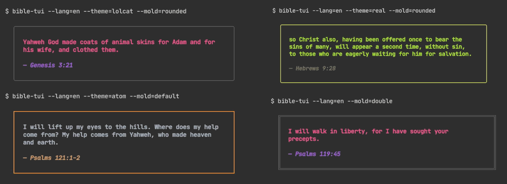

# Bible TUI
Get Bible Verses via Command Line

 

---

## 🙏 `bible-tui` 
`bible-tui` is a command line utility that displays dynamic or selected verses from the Bible with different frames and color themes. Available in English and Portuguese.

---

## 📦 Dependencies
+ C++ Compiler: [GCC](https://gcc.gnu.org/) or [Clang](https://clang.llvm.org/)
+ [CMake](https://cmake.org/)

---

## 🚧 Build and Install
```bash
git clone https://github.com/terroo/bible-tui
cd bible-tui
cmake . -B build
cmake --build build
sudo cmake --install build
```

---

## 💼 Usage and Examples

 

Help: `bible-tui --hel`

```bash
Usage:
bible-tui [options]

Options:
  --lang=pt|en                        Set the language.
  --theme=real|lolcat|atom|style      Set the color theme.
  --mold=default|double|rounded|empty Set the border style.
  --book=name:num-num                 Set the book and verse.
                                         Examples:
                                           [EN]psalms:23-1 | [PT]salmos:23-1
  --help, -h                          Show this message.
  --version, -v                       Show version info.

```

---

> **`bible-tui`** is still in early versions, if you find any *bugs*, please open an [issue](https://github.com/terroo/bible-tui/issues).
